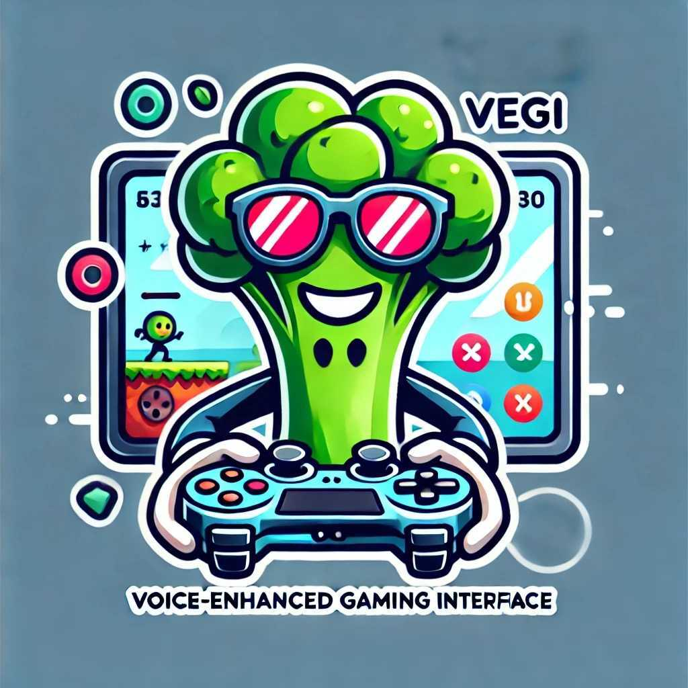

<div align="center" id="top"> 
  

  &#xa0;

  <!-- <a href="https://vegi.netlify.app">Demo</a> -->
</div>


<h1 align="center">VEGI (ˈve-jē') : Voice-Enhanced Gaming Interface</h1>

<!-- 
 <p align="center">
  

  

  

  

   

  

   
</p> -->

<!-- Status -->

<!-- <h4 align="center"> 
	🚧  Vegi 🚀 Under construction...  🚧
</h4>  -->

<hr>

<p align="center">
  <a href="#dart-about">About</a> &#xa0; | &#xa0; 
  <a href="#sparkles-features">Features</a> &#xa0; | &#xa0;
  <a href="#rocket-technologies">Technologies</a> &#xa0; | &#xa0;
  <a href="#white_check_mark-requirements">Requirements</a> &#xa0; | &#xa0;
  <a href="#checkered_flag-starting">Starting</a> &#xa0; | &#xa0;
  <a href="#pill-todo">TODO</a> &#xa0; | &#xa0;
  <a href="#memo-license">License</a> &#xa0; | &#xa0;
  <a href="https://github.com/pyuvaraj37" target="_blank">Author</a>
</p>

<br>

## :dart: About ##

The Voice-Enhanced Gaming Interface (VEGI) is an AI solution to provide real-time voice generation for various games. Created for the AMD Perversive AI Developer Contest on Hackster: [VEGI](https://www.hackster.io/516129/vegi-ve-je-voice-enhanced-gaming-interface-c00747).

## :sparkles: Features ##

:heavy_check_mark: Pokemon Emerald voiced cutscenes using OCR.

:heavy_check_mark: League of Legends champion voiced in-game chat.

:heavy_check_mark: Many more TODO...

## :rocket: Technologies ##

The following tools were used in this project:

- [Python 3.11](https://www.python.org/downloads/release/python-3110/)
- [Node.js](https://nodejs.org/en/)
- [Conda](https://conda.io/projects/conda/en/latest/user-guide/install/index.html)
- [RyzenAI-SW](https://github.com/amd/RyzenAI-SW)

## :white_check_mark: Requirements ##

Before starting :checkered_flag:, you need to understand the hardware you plan to run VEGI on. There is support for CPU, GPU, and AMD's NPU, with the last one requiring special drivers to be setup. NOTE: NPU must be run and set up using the [AMD DOCs](). 

If you intend to use the League of Legends champion voice in-game, you will first need to install [Overwolf](). Then go to the appstore and install [VEGI](). 

You will need to have [Python 3.11](https://www.python.org/downloads/release/python-3110/), and suggested to use a [Conda](https://conda.io/projects/conda/en/latest/user-guide/install/index.html) virtual enviorment.

## :checkered_flag: Starting ##

```bash
# Clone this project
$ git clone https://github.com/pyuvaraj37/vegi.git

# Access
$ cd vegi
```

CPU/GPU

```bash
# Install dependencies
$ python -m pip install requirements.txt
```

AMD's NPU (setup up RyzenAI-SW github first)
```bash
#Set up the transformer example from RyzenAI-SW and install all depedencies
#Once the setup.bat is run, you can continue below.

#Install dependencies
$ python -m pip install requirements.txt


```

Run with the desired configuration. For League of Legends make sure to have Overwolf and the VEGI Overwolf app installed.
```bash
#Run with configurations
$ python vegi.py --device <CPU/GPU/NPU> --game <Pokemon/LOL>
```

Overwolf:
Run sample-app by following https://overwolf.github.io/start/basic-app/sample-app (only tested with League of Legends chat) need Developer account on Overwolf.

## :pill: TODO ##

NPU:
- Intall env for ryzenai-transformers (need to add steps here later) and run setup.bat from RyzenAI (Create new setup.bat for VEGI)

GPU: 
- Needs to add cuda support 

Two paths:

OCR: 
- Grab games dialogue from input coordinates, need to calibrate it for pokemon for AMD Contest. 

Overwolf: 
- Need to streamline data transfer or package vegi with overwolf app. 
- Package sample app as VEGI to make it easy to run. 

## :memo: License ##

This project is under license from MIT. For more details, see the [LICENSE](LICENSE.md) file.


Made with :heart: by <a href="https://github.com/pyuvaraj37" target="_blank">pyuvaraj37</a>

&#xa0;

<a href="#top">Back to top</a>
